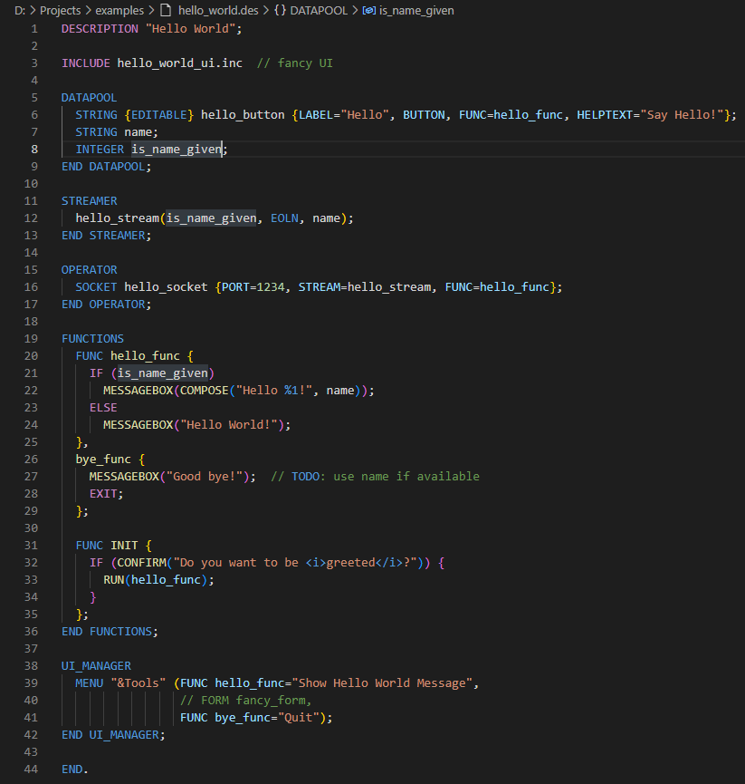
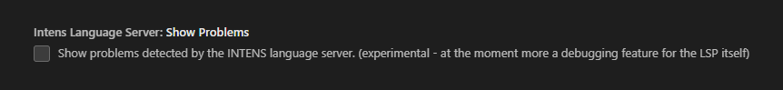

# Language Support for INTENS

## About

This is an unofficial extension to provide syntax highlighting for the so called [INTENS](https://www.semafor.ch/products/intens/)&reg; language of the company Semafor AG.

## Call for Sponsorship

This is a **free extension**.
If you find it useful to yourself or your business then you might consider [sponsoring](https://ko-fi.com/anticultist) it.

## Features

- Syntax highlighting
- Language server features

  - bread crumbs and resource symbol listing
  - Highlighting of syntax errors (experimental)

## Showcase

## Configuration

To activate the experimental error checking go to the settings and search for `intensLanguageServer.showProblems`.

## Known issues

- unsupported or bad supported features
  - `DB_MANAGER` block
  - `INCLUDE` statement
  - C/C++ preprocessor directives

This suboptimal support is due to lack of real world examples.
Therefore feel free to [create an issue](https://github.com/anticultist/vscode-intenslang/issues/new) to provide a minimal code example with a brief description to close this knowledge gap.
